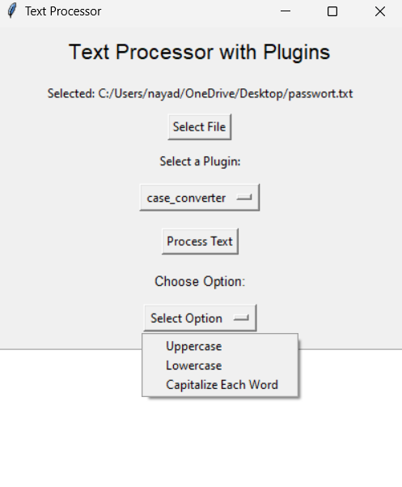

# Textprozessor mit Plugins

Dies ist eine flexible Textverarbeitungsanwendung, die mit Python und Tkinter entwickelt wurde. Sie unterstützt Plugins wie Verschlüsselung, Entschlüsselung und andere Textmanipulationsfunktionen. Die Benutzer können Dateien laden, Plugins anwenden und die Ergebnisse anzeigen oder speichern.

## Hauptfunktionen

- **Datei auswählen**: Laden Sie Textdateien zur Verarbeitung.
- **Plugin auswählen**: Verschiedene Plugins anwenden (z. B. Verschlüsselung, Entschlüsselung).
- **Zusätzliche Eingaben**: Geben Sie erforderliche Parameter (wie Schlüssel) ein.
- **Ergebnis anzeigen**: Verarbeiteter Text wird direkt in der Benutzeroberfläche angezeigt.
- **Speichern**: Speichern Sie die Ergebnisse in einer Datei.
- **Verschlüsselungsschlüssel-Management**: Anzeigen und Kopieren von Verschlüsselungsschlüsseln.

---

## Voraussetzungen

### 1. Software

1. **[Git](https://git-scm.com/downloads/)**: Zum Klonen des Repositories.  
   Installiere Git, um Repositories von Plattformen wie GitHub zu klonen und Änderungen zu verwalten.

2. **[Python 3.x](https://www.python.org/downloads/)**: Stellen Sie sicher, dass Python installiert ist.  
   Besuche den Link, um die neueste Version von Python herunterzuladen und zu installieren.


## **Schritt 1: Git Repository Clonen**

**Wichtig:** Bitte wie unter Kapitel Voraussetzung beschrieben zuerst Git installieren, bevor diese Schritte durchgeführt werden.

### Schritte
1. Öffne die  Eingabeaufforderung.  

2. Navigiere zu dem Ordner, in dem du das Repository speichern möchtest:  

   ```bash
   cd pfad/zum/ordner

3. Clone das Repository mit folgendem Befehl:
    ```bash
    git clone https://github.com/edu008/SDA2_2.git

4. Git erstellt automatisch einen neuen Ordner mit dem Namen des Repositories (SDA2_2) und lädt alle Dateien in diesen Ordner.

Jetzt sollten die Daten aus dem Git-Repository auf deinem Computer im angegebenen Pfad heruntergeladen worden sein, und du kannst mit dem nächsten Schritt fortfahren.

---

## **Schritt 1: Abhängigkeiten installieren**
1. Öffne die  Eingabeaufforderung.  

2. Navigiere zu dem Ordner, in dem sich das Repository befindet:



3. Abhängigkeiten installieren
```bash
    git clone https://github.com/edu008/SDA2_2.git
```


2. **Abhängigkeiten installieren**:
   \`\`\`bash
   pip install -r requirements.txt
   \`\`\`

3. **Programm starten**:
   \`\`\`bash
   python main.py
   \`\`\`

---

## Schritt-für-Schritt Anleitung zur Nutzung

1. **Benutzeroberfläche öffnen**:
   Starten Sie die Anwendung mit \`python main.py\`. Es öffnet sich eine grafische Oberfläche.

2. **Textdatei auswählen**:
   - Klicken Sie auf die Schaltfläche **"Select File"**.
   - Navigieren Sie zu einer Textdatei und wählen Sie diese aus.

3. **Plugin auswählen**:
   - Wählen Sie ein Plugin aus der Dropdown-Liste, z. B. \`Enigma\` oder \`Turing\`.
   - Jedes Plugin hat spezifische Funktionen (siehe Abschnitt *Plugins*).

4. **Zusätzliche Eingaben bereitstellen** (falls nötig):
   - Einige Plugins (z. B. Verschlüsselung) erfordern zusätzliche Eingaben wie Schlüssel.
   - Geben Sie diese im Eingabefeld ein, das angezeigt wird.

5. **Text verarbeiten**:
   - Klicken Sie auf **"Process Text"**, um das Plugin anzuwenden.
   - Der verarbeitete Text wird im Hauptfenster angezeigt.

6. **Ergebnis speichern**:
   - Klicken Sie auf **"Save Output"**, um die Datei zu speichern.
   - Wählen Sie einen Speicherort und einen Dateinamen.

### Verschlüsselungsschlüssel
- Wenn ein Plugin (z. B. \`Enigma\`) einen Schlüssel generiert:
  - Ein separates Fenster zeigt den Schlüssel an.
  - Klicken Sie auf **"Copy Key"**, um ihn in die Zwischenablage zu kopieren.

---

## Plugins hinzufügen

Plugins werden im Verzeichnis \`plugins\` gespeichert. Sie können neue Plugins erstellen, indem Sie eine Klasse mit einer \`process\`-Methode implementieren. Das Format ist wie folgt:

\`\`\`python
class Plugin:
    def process(self, text: str, key: str = None) -> str:
        # Verarbeitung des Textes hier
        return processed_text
\`\`\`

Fügen Sie die neue Plugin-Datei in den Ordner \`plugins\` ein. Beim nächsten Start der Anwendung wird sie automatisch erkannt.

---

## Plugins


### 1. **Enigma Plugin**
- Funktion: Verschlüsselt den Text.
- Besonderheit: Zeigt den generierten Verschlüsselungsschlüssel an, der für die Entschlüsselung benötigt wird.

### 2. **Turing Plugin**
- Funktion: Entschlüsselt den Text.
- Voraussetzung: Ein gültiger Schlüssel muss angegeben werden, um die Entschlüsselung durchzuführen.

### 3. **CaseConverter Plugin**
- Funktion: Ändert die Gross-/Kleinschreibung im Text.
- Optionen:
  - Alles kleingeschrieben.
  - Alles grossgeschrieben.
  - Nur der erste Buchstabe eines jeden Satzes wird grossgeschrieben.

### 4. **TextSearch Plugin**
- Funktion: Sucht ein bestimmtes Wort in einer Datei.
- Ergebnis: Gibt die Anzahl der Vorkommen des Wortes aus.

### 5. **WordCounter Plugin**
- Funktion: Zählt die Gesamtanzahl der Wörter in einer Datei.
- Anwendung: Nützlich für Statistiken oder Analyse der Textlänge.

---


