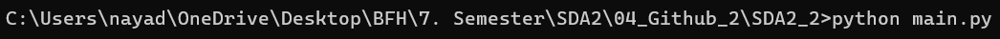
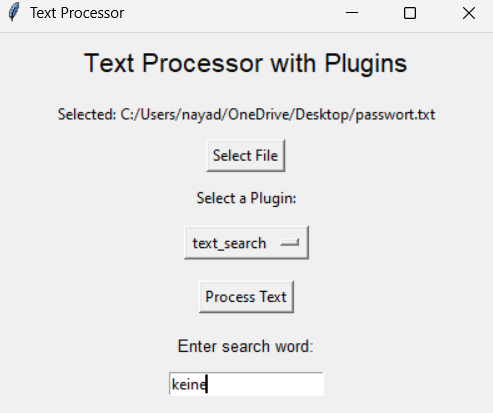
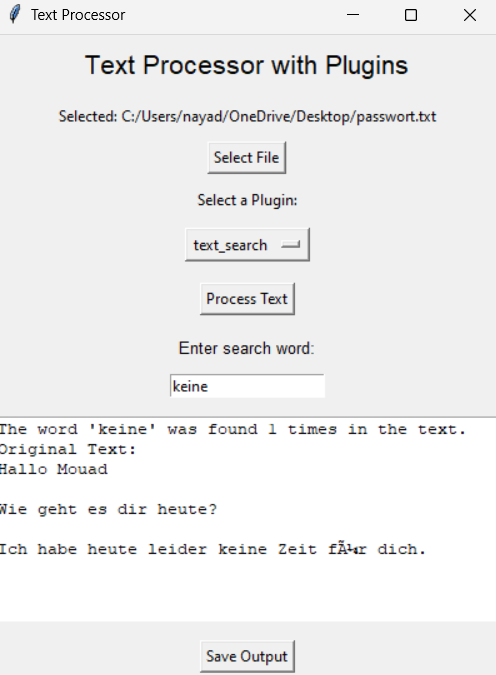
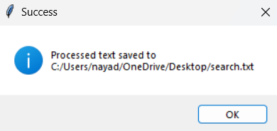
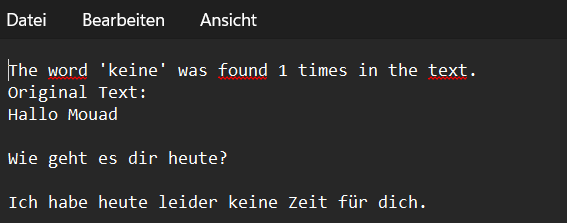
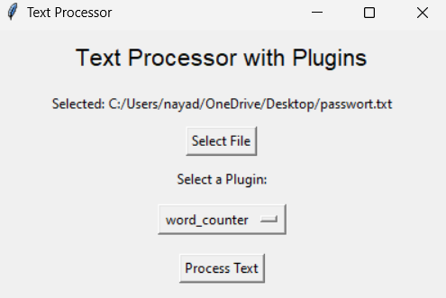
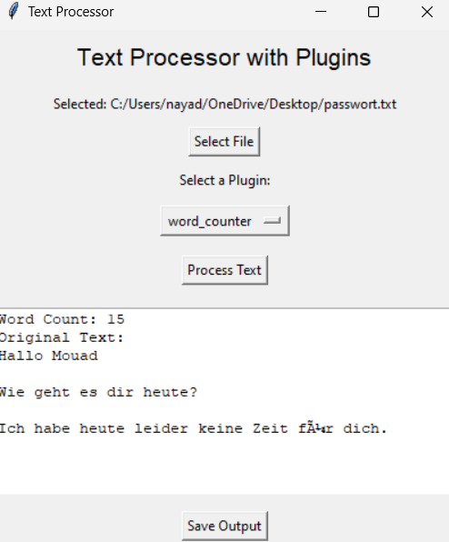
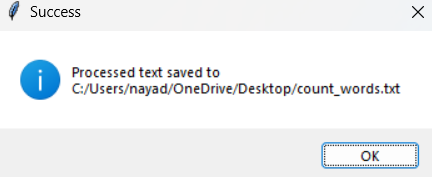
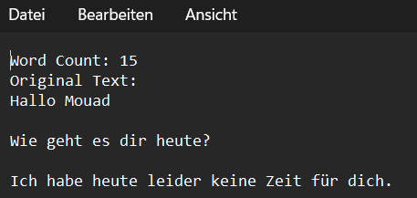

<!-- @import "[TOC]" {cmd="toc" depthFrom=1 depthTo=6 orderedList=false} -->

<!-- code_chunk_output -->

- [Textprozessor mit Plugins](#textprozessor-mit-plugins)
  - [Hauptfunktionen](#hauptfunktionen)
  - [Voraussetzungen](#voraussetzungen)
    - [1. Software](#1-software)
  - [**Schritt 1: Git Repository Clonen**](#schritt-1-git-repository-clonen)
    - [Schritte](#schritte)
  - [**Schritt 2: Abhängigkeiten installieren**](#schritt-2-abhängigkeiten-installieren)
  - [**Schritt 3: Programm starten**](#schritt-3-programm-starten)
  - [Erklärung von GUI und Plugins](#erklärung-von-gui-und-plugins)
    - [1. **Enigma Plugin**](#1-enigma-plugin)
    - [2. **Turing Plugin**](#2-turing-plugin)
    - [3. **CaseConverter Plugin**](#3-caseconverter-plugin)
    - [4. **TextSearch Plugin**](#4-textsearch-plugin)
    - [5. **WordCounter Plugin**](#5-wordcounter-plugin)
  - [Schritt-für-Schritt Anleitung zur Nutzung](#schritt-für-schritt-anleitung-zur-nutzung)
    - [1. **Enigma Plugin**](#1-enigma-plugin-1)
    - [2. **Turing Plugin**](#2-turing-plugin-1)
    - [3. **CaseConverter Plugin**](#3-caseconverter-plugin-1)
    - [4. **TextSearch Plugin**](#4-textsearch-plugin-1)
    - [5. **WordCounter Plugin**](#5-wordcounter-plugin-1)

<!-- /code_chunk_output -->


# Textprozessor mit Plugins

Dies ist eine flexible Textverarbeitungsanwendung, die mit Python und Tkinter entwickelt wurde. Sie unterstützt Plugins wie Verschlüsselung, Entschlüsselung und andere Textmanipulationsfunktionen. Die Benutzer können Dateien laden, Plugins anwenden und die Ergebnisse anzeigen oder speichern.

## Hauptfunktionen

- **Datei auswählen**: Laden Sie Textdateien zur Verarbeitung.
- **Plugin auswählen**: Verschiedene Plugins anwenden (z. B. Verschlüsselung, Entschlüsselung).
- **Zusätzliche Eingaben**: Geben Sie erforderliche Parameter (wie Schlüssel) ein.
- **Ergebnis anzeigen**: Verarbeiteter Text wird direkt in der Benutzeroberfläche angezeigt.
- **Speichern**: Speichern Sie die Ergebnisse in einer Datei.
- **Verschlüsselungsschlüssel-Management**: Anzeigen und Kopieren von Verschlüsselungsschlüsseln.

---

## Voraussetzungen

### 1. Software

1. **[Git](https://git-scm.com/downloads/)**: Zum Klonen des Repositories.  
   Installiere Git, um Repositories von Plattformen wie GitHub zu klonen und Änderungen zu verwalten.

2. **[Python 3.x](https://www.python.org/downloads/)**: Stellen Sie sicher, dass Python installiert ist.  
   Besuche den Link, um die neueste Version von Python herunterzuladen und zu installieren.


## **Schritt 1: Git Repository Clonen**

**Wichtig:** Bitte wie unter Kapitel Voraussetzung beschrieben zuerst Git installieren, bevor diese Schritte durchgeführt werden.

### Schritte
1. Öffne die  Eingabeaufforderung.  

2. Navigiere zu dem Ordner, in dem du das Repository speichern möchtest:  

   ```bash
   cd pfad/zum/ordner

3. Clone das Repository mit folgendem Befehl:
    ```bash
    git clone https://github.com/edu008/SDA2_2.git

4. Git erstellt automatisch einen neuen Ordner mit dem Namen des Repositories (SDA2_2) und lädt alle Dateien in diesen Ordner.

Jetzt sollten die Daten aus dem Git-Repository auf deinem Computer im angegebenen Pfad heruntergeladen worden sein, und du kannst mit dem nächsten Schritt fortfahren.

---

## **Schritt 2: Abhängigkeiten installieren**
1. Öffne die  Eingabeaufforderung.  

2. Navigiere zu dem Ordner, in dem sich das Repository befindet:


3. Abhängigkeiten installieren
```bash
    pip install -r requirements.txt
```

Mein Beispiel:


---

## **Schritt 3: Programm starten**
1. Öffne die  Eingabeaufforderung.  

2. Navigiere zu dem Ordner, in dem sich das Repository befindet:

3. **Programm starten**:
```bash
    python main.py
```

Mein Beispiel:



Nach dem sollte sich automatisch das Programm öffnen und sieht so aus:


---

## Erklärung von GUI und Plugins
Bevor wir mit dem GUI arbeiten können, müssen wir zuerst die Plugins verstehen. Deshalb erkläre ich kurz die Plugins:

### 1. **Enigma Plugin**
- Funktion: Verschlüsselt den Text.
- Besonderheit: Zeigt den generierten Verschlüsselungsschlüssel an, der für die Entschlüsselung benötigt wird.

### 2. **Turing Plugin**
- Funktion: Entschlüsselt den Text.
- Voraussetzung: Ein gültiger Schlüssel muss angegeben werden, um die Entschlüsselung durchzuführen.

### 3. **CaseConverter Plugin**
- Funktion: Ändert die Gross-/Kleinschreibung im Text.
- Optionen:
  - Alles kleingeschrieben.
  - Alles grossgeschrieben.
  - Nur der erste Buchstabe eines jeden Satzes wird grossgeschrieben.

### 4. **TextSearch Plugin**
- Funktion: Sucht ein bestimmtes Wort in einer Datei.
- Ergebnis: Gibt die Anzahl der Vorkommen des Wortes aus.

### 5. **WordCounter Plugin**
- Funktion: Zählt die Gesamtanzahl der Wörter in einer Datei.
- Anwendung: Nützlich für Statistiken oder Analyse der Textlänge.

---

## Schritt-für-Schritt Anleitung zur Nutzung

Bevor wir anfangen, wollte ich zuerst zeigen mit welcher TXT-Datei wir hier arbeiten:

Dateiname: password.txt

Inhalt:


Jetzt kann die Anwendung gestartet werden:

1. Öffne die  Eingabeaufforderung.  

2. Navigiere zu dem Ordner, in dem sich das Repository befindet:

3. **Programm starten**:
```bash
    python main.py
```

Hier wird dokumentiert, wie die einzelnen Plugins auf dem GUI ausgeführt werden:

### 1. **Enigma Plugin**

Mit diesem Plugin sollte die gewählte Datei verschlüsselt werden. Später im Abschnitt "Turing Plugin" sehen wir dann, wie man die Datei wieder entschlüsselt.

1. Klicken Sie auf die Schaltfläche **"Select File"**.
2. Navigieren Sie zu einer Textdatei und wählen Sie diese aus.
3. Wählen Sie das Plugin "enigma" aus der Dropdown-Liste.
4. Klicken Sie dann auf "Process Text":


5. Jetzt solltet ihr die nachfolgende Ergebnis erhalten haben:


Sie haben hier einen Entschlüsselungsschlüssel erhalten, die Sie kopieren und sicher ablegen müssen, so dass wir die Datei später entschlüsseln können!

6. Mit "Save Output" kann man die Datei noch am gewünschen Speicherort speichern:


Sie könnne unten auch sehen, wie der Inhalt vom Datei aussieht.

7. Wenn das Speichern erfolgreich war, erhaltet ihr die nachfolgende Meldung:


8. Der Inhalt der Datei sieht nun so aus:


Man kann es nicht mehr lesen ohne die Entschlüsselung. Jetzt fahren wir mit dem zweiten Plugin "Turing" fort, um zu sehen wie man es entschlüsselt.

### 2. **Turing Plugin**

Mit diesem Plugin sollte die gewählte Datei mit der Entschlüsslungsschlüssel wieder entschlüsselt werden.

1. Klicken Sie auf die Schaltfläche **"Select File"**.
2. Navigieren Sie zu der verschlüsselten Textdatei und wählen Sie diese aus.
3. Wählen Sie das Plugin "turing" aus der Dropdown-Liste.
4. Jetzt müssen Sie noch die Entschlüsslungsschlüssel unter "Enter Key:" eingeben:


5. Drücken Sie nun auf "Process Text" und sie sollten unten im Textfeld die entschlüsselte Inhalt vom Datei sehen:


Wenn Sie möchten, können Sie es auch irgendwo mit dem Button "Save Output" speichern.

### 3. **CaseConverter Plugin**

Mit diesem Plugin sollten folgende Möglichkeiten geben:
- Alles in Grossbuchstaben
- Alles in Kleinbuchstaben
- Erster Buchstaben von jedem Wort in Grossbuchstaben

In dieser Anleitung werde ich die Option "Uppercase" wählen. Sie können auch die anderen Optionen auswählen, da der Vorgang bei allen gleich ist.

1. Klicken Sie auf die Schaltfläche **"Select File"**.
2. Navigieren Sie zu einer Textdatei und wählen Sie diese aus.
3. Wählen Sie das Plugin "case_converter" aus der Dropdown-Liste.
4. Sobald Sie "case_coverter" gewählt haben erscheint unten noch ein neuer Button "Choose Option".
5. Klicken Sie auf "Choose Option" und wählen Sie "Uppercase" aus:


5. Klicken Sie auf "Process Text":


### 4. **TextSearch Plugin**

Mit diesem Plugin können Sie in der Datei nach einem gewünschen Word suchen.

1. Klicken Sie auf die Schaltfläche **"Select File"**.
2. Navigieren Sie zu einer Textdatei und wählen Sie diese aus.
3. Wählen Sie das Plugin "text_search" aus der Dropdown-Liste.
4. Sobald Sie "text_search" gewählt haben erscheint unten ein Textfeld.
5. Bitte geben Sie im leeren Textfeld nach dem Wort aus, die Sie im Text suchen möchten und klicken Sie auf "Process Text":



6. Nach dem sollte das Resultat unten erscheinen:



7. Mit "Save Output" kann die Ausgabe als eine Textdatei am gewünschten Ort gespeichert werden.

8. Wenn Sie gespeichert haben, sollte die nachfolgende Meldung erscheinen:



9. Der Inhalt der Datei sollte so aussehen:



### 5. **WordCounter Plugin**

Mit diesem Plugin können Sie die Wörter im Textdatei zählen.

1. Klicken Sie auf die Schaltfläche **"Select File"**.
2. Navigieren Sie zu einer Textdatei und wählen Sie diese aus.
3. Wählen Sie das Plugin "word_counter" aus der Dropdown-Liste.
4. Klicken Sie anschliessend auf "Process Text":



5. Nach dem wird das folgende Inhalt unten angezeigt:



Es sind total 15 Wörter in der Datei "password.txt" enthalten.

6. Mit "Save Output" können Sie das Resultat auch am gewünschen Ort speichern.

7. Wenn Sie erfolgreich gespeichert haben, sollte die nachfolgende Meldung erscheinen:



8. Wenn Sie nun die Datei öffnen, sollte der folgende Inhalt ersichtlich sein:



---
